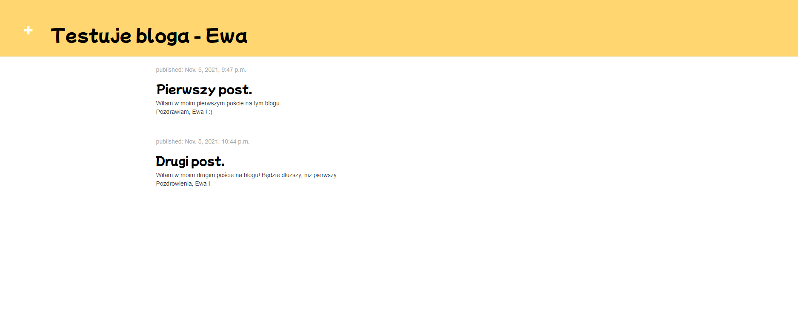
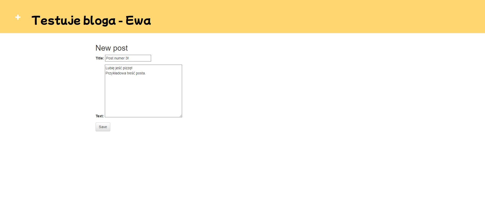
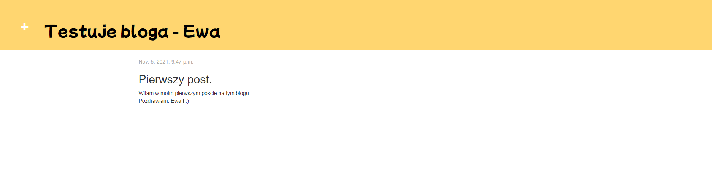
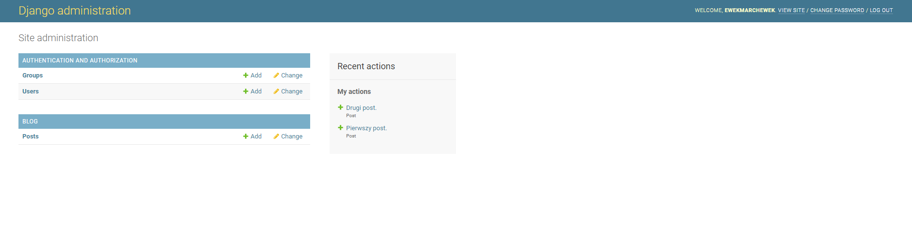
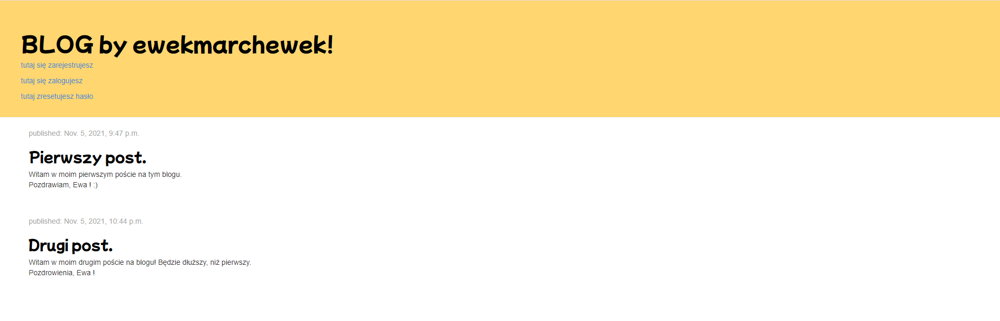
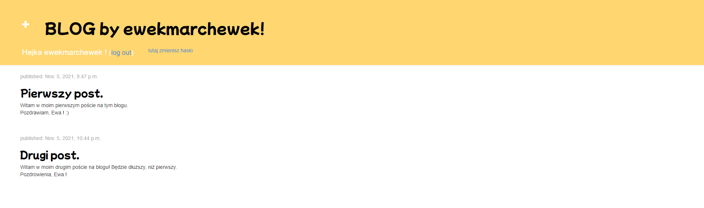
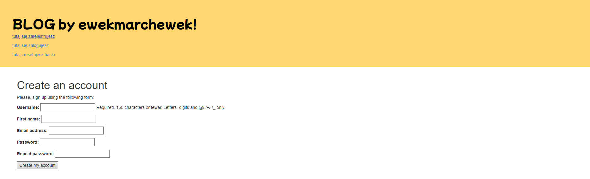
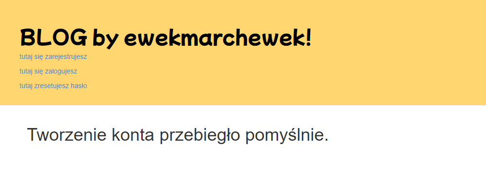
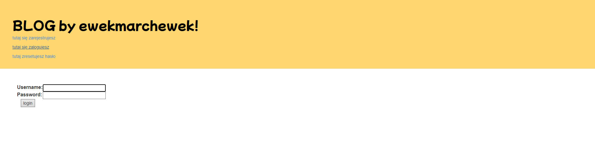
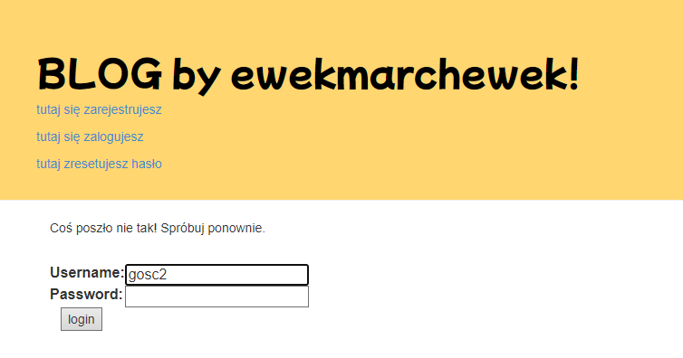

# Aplikacje internetowe 22665 195ICA

## Laboratorium 1 - Blog

Link do bloga na heroku - [BLOG](https://ewekmarchewek-blog.herokuapp.com/blog/)

#### Strona startowa

Po wejściu na stronę, można zauważyć tytuł strony oraz dodane posty. 
W lewym górnym rogu widać plus, za którego pomocą możemy dodać nowy post.

#### Dodawanie postu

Po wciśnieciu wcześniej wspomnianego plusa, przechodzimy do okna, w którym możemy stowrzyć nowy post.

#### Detale postu

Po kliknięciu na tytuł posta, wyświetlają się jego detale. 

### Panel administratora

## Laboratorium 2 - Blog i konta użytkowników.

#### Widok bloga przed zalogowaniem się użytkownika.

#### Widok bloga po zalogowaniu się użytkownika

#### Formularz rejestracji

#### Pomyślna rejestracja użytkownika

####Formularz logowania

####Niepomyślne logowanie

####Formularz resetowania hasła
