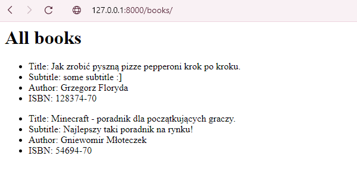

# Aplikacje internetowe 22665 195ICA

<a href="#Laboratorium1">Laboratorium 1</a>

<a href="#Laboratorium2">Laboratorium 2</a>
  

<a href="#Laboratorium3">Laboratorium 3</a>

<a href="#Laboratorium4">Laboratorium 4</a>

<a href="#Laboratorium5">Laboratorium 5</a>

<a href="#Laboratorium9">Laboratorium 9</a>

<a href="#Laboratorium10">Laboratorium 10</a>

## Laboratorium 1 - Blog

Link do bloga na heroku - [BLOG](https://ewekmarchewek-blog.herokuapp.com/blog/)

#### Strona startowa

Po wejściu na stronę, można zauważyć tytuł strony oraz dodane posty. 
W lewym górnym rogu widać plus, za którego pomocą możemy dodać nowy post.

#### Dodawanie postu

Po wciśnieciu wcześniej wspomnianego plusa, przechodzimy do okna, w którym możemy stowrzyć nowy post.

#### Detale postu

Po kliknięciu na tytuł posta, wyświetlają się jego detale. 

### Panel administratora

## Laboratorium 2 - Blog i konta użytkowników.

#### Widok bloga przed zalogowaniem się użytkownika.

#### Widok bloga po zalogowaniu się użytkownika

#### Formularz rejestracji

#### Pomyślna rejestracja użytkownika

#### Formularz logowania

#### Niepomyślne logowanie

#### Formularz resetowania hasła

## Laboratorium 3 - Różne sposoby uwierzytelniania.
#### Uwierzytelnianie za pomocą Google

#### Uwierzytelnianie za pomocą Facebooka

## Laboratorium 4 - REST API z DRF.
#### Books ( dodanie własnej książki )

#### Books - wyświetlanie listy książek

#### API Books

## Laboratorium 5 - Web Scraping.
#### Podczas scrape'owania najczęściej zależy nam na wyciągnięciu informacji z kodu HTML na stronach, do tego przydadzą się biblioteka Beautifulsoup oraz pakiet Requests. 
#### Za pomocą biblioteki Requests możemy pobierać strony w Pythonie, a pakiet Beautifulsoup analizuje kod HTML i pomaga w formatowaniu i organizowaniu danych ze strony internetowej na bardziej przyjazne dla oka struktury.
#### Jeśli chcemy wyodrębnić pojedynczy tag, możemy użyć metody find (find_all), która znajdzie wszystkie wystąpienia tagu na stronie. Używając tej samej metody można zbadać konkretną klasę lub identyfikator na stronie. Żeby dowiedzieć się, jak oznaczony jest element, który chcemy znaleźć wystarczy na wybranej stronie internetowej użyć opcji Inspect (zbadaj element)

#### W kodzie szukamy elementów, które nas interesują :

#### Jako pierwszy przykład scrape'ingu pobiorę ze [strony](https://coreyms.com) nagłówki postów razem z treściami i linkami do filmików na youtube. Zapiszę je w pliku scrape_one.

#### Jak widać, wybrane elementy wyświetliły się w konsoli oraz zostały zapisane w pliku scrape_one - dane są od siebie oddzielone przecinkami.

#### W drugim przykładzie pobiorę ze [strony](https://pl.wikisource.org/wiki/Kategoria:Polscy_poeci) autorów wierszy i podam czas, który komputer poświęcił na pobranie informacji.

#### Pobiorę 10 pierwszych autorów

#### Dodam też foldery z autorami (niestety bez polskich znaków).

## Laboratorium 9 - Django + React (aplikacja CRUD)

## Laboratorium 10 - Django + React (aplikacja typu ToDo)

### backend
1. TODO admin panel

2. TOTO - task add

3. TODO - task delete

4. TODO - delete confirm

5. TODO - deleted task

6. TODO - Api todos

7. TODO - todolist

8. TODO - example task 2 address

### frontend
 

