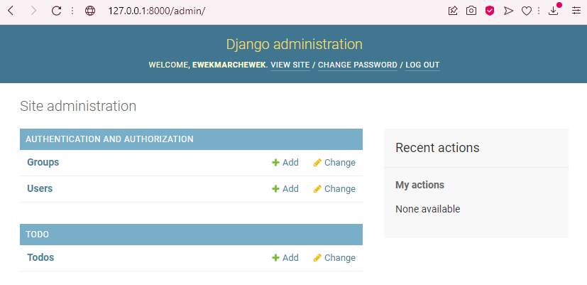
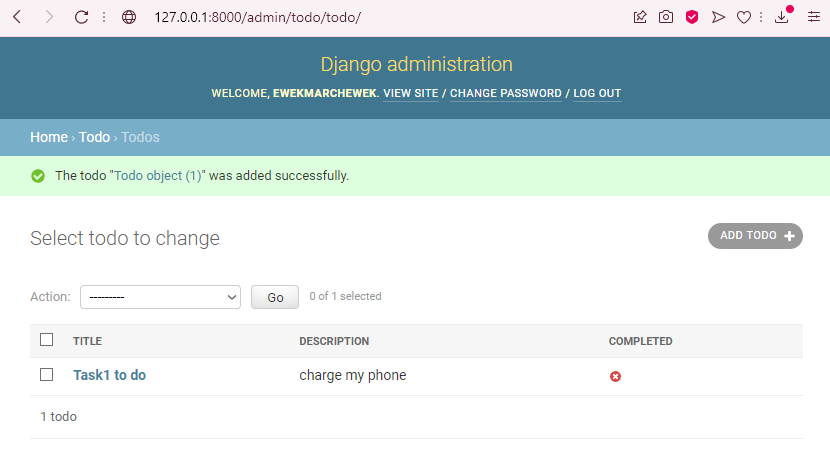
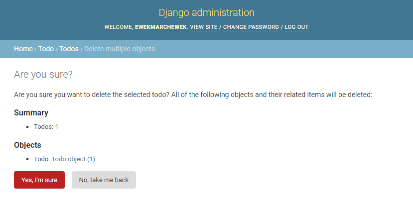
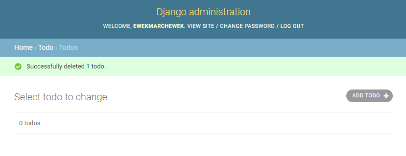
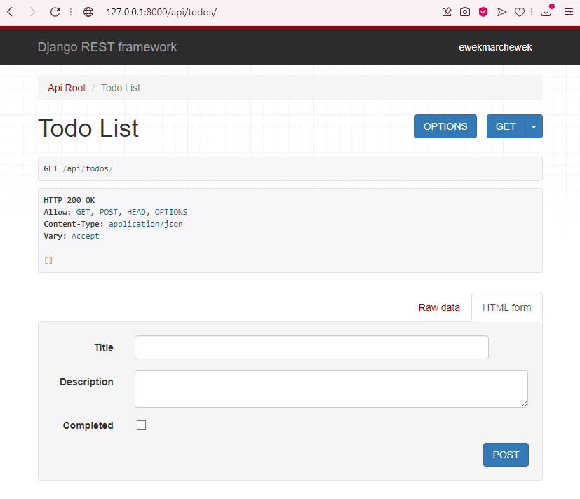
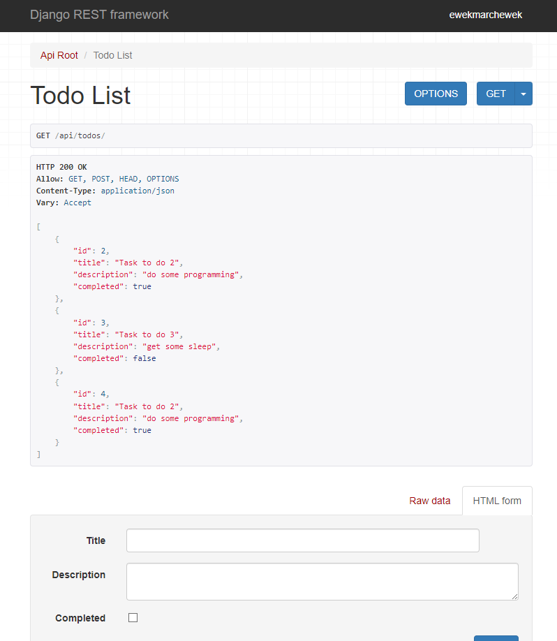
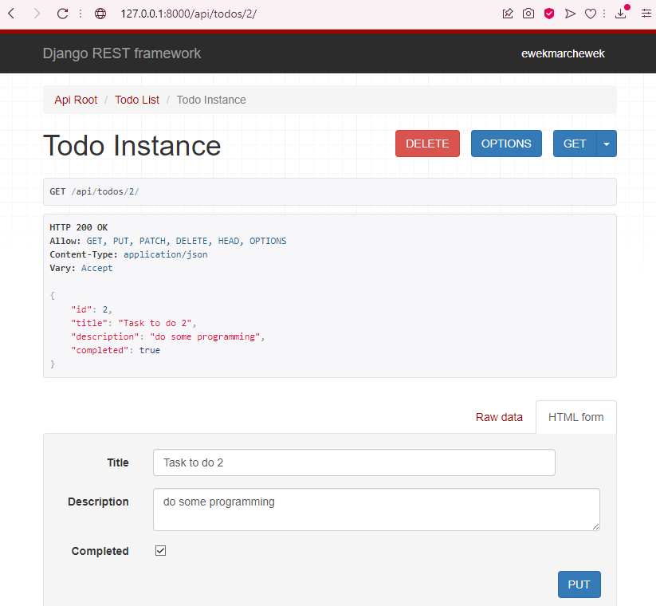
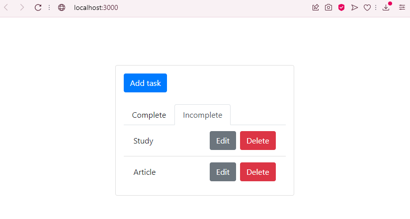
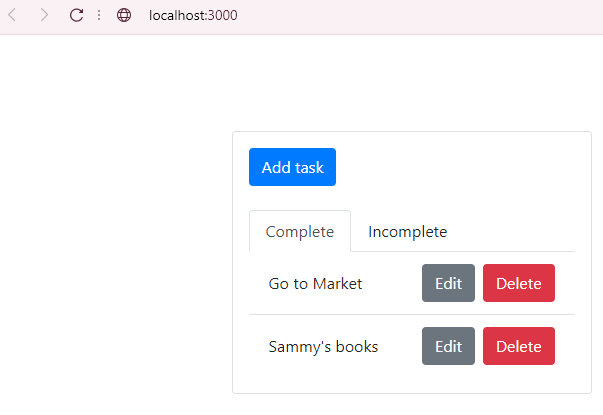
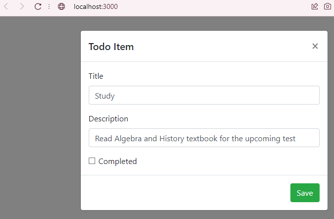

## Laboratorium 10 - Django + React (aplikacja typu ToDo)

### backend
1. TODO admin panel

2. TOTO - task add

3. TODO - task delete

4. TODO - delete confirm

5. TODO - deleted task

6. TODO - Api todos

7. TODO - todolist

8. TODO - example task 2 address

### frontend
 

